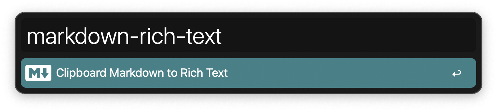
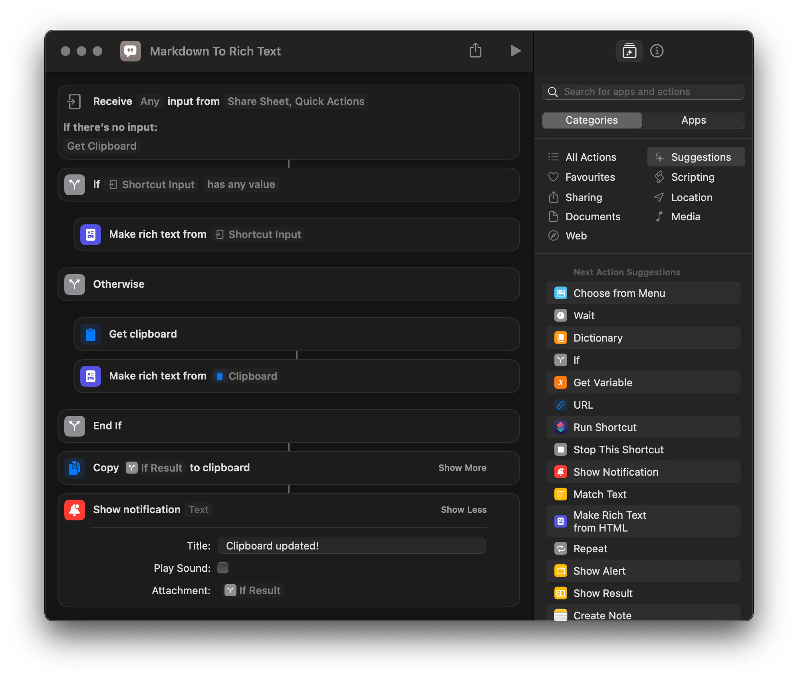
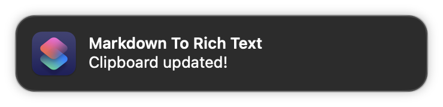

# What is it?

A simple Apple shortcut to generate Rich text from Markdown input (selected text -> service) or clipboard.

Additionally an Alfred workflow, which will run the Apple shorcut with the clipboard as input.

## Install the shortcut

1. Clone the repository
2. Install the apple shortcut from `shortcut` directory
3. Install the alfred workflow from `alfred` directory
4. Make sure to allow any missing accessibility privileges

## Compatibility

### Tested

- macOS Ventura 13.4
- alfred 5.1

## Screenshots

